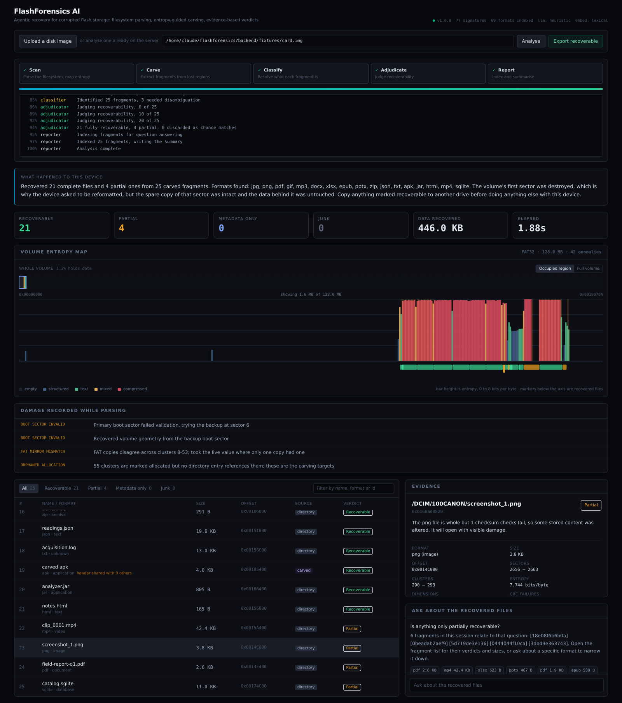

# FlashForensics AI

Agentic recovery for corrupted flash storage. Parses FAT32 and exFAT volumes at the byte level, maps entropy to find where the damage is, carves the regions the filesystem has lost, and returns a ranked list of what can actually be recovered with the evidence behind every verdict.

**PhotoRec tells you it found 9,000 files. This tells you which 40 are your photos, and why.**



---

## The problem

You pull an SD card out while a photo is saving. Or it wears out. Or you hit format by accident. The card now reads as empty, but the photos are still physically on it. What broke is the table of contents: a card stores the data and a map saying "vacation.jpg starts at block 4820 and continues at 4821, 4822". When that map dies, the bytes are all still there and nothing knows where any file begins or ends.

Existing recovery tools solve this by ignoring the map and scanning for known byte signatures. Every JPEG starts `FF D8 FF`, every PNG starts `89 50 4E 47`. This works, and it hands you a folder of nine thousand files named `f0001.jpg` through `f9000.jpg`. Most are garbage, some are half a photo, a few are your wedding pictures, and the tool has no idea which. You open them one at a time for three hours.

It is also blind to ambiguity. ZIP, DOCX, XLSX, PPTX, APK, JAR, EPUB and ODT all begin with the same four bytes, `PK 03 04`, because they are all zip containers. A signature carver labels every one of them "zip".

**The bottleneck in data recovery was never finding bytes. It is triage.** That is what this automates.

## What it does

1. **Parses the filesystem directly.** A hand-written FAT32 and exFAT parser, no `pytsk3`, no compiled dependency. It recovers volume geometry from the backup boot sector when sector 0 is destroyed, reconciles the two FAT copies to salvage entries that survive in only one, and records every structural inconsistency as evidence rather than raising on the first one.

2. **Maps entropy across the volume.** Empty space measures near 0 bits per byte, text 4 to 6.5, compressed and encrypted data above 7.5. One pass produces a profile showing where real data lives and where the damage is, so carving skips empty space instead of grinding through it. Entropy transitions are themselves evidence: a file that drops to zero mid-stream was truncated.

3. **Carves the orphaned regions.** Clusters the allocation table still reserves but no directory entry claims, plus free space that is not actually empty. Extents come from parsing the format's own structure, not from dumping a fixed number of bytes.

4. **Identifies what each fragment really is.** Structural evidence first, retrieval against a 69-format knowledge base second, a language model only for what those leave open. Zip entry names separate a DOCX from an APK; the ISO base media brand separates an MP4 from a HEIC.

5. **Judges recoverability and explains it.** Four statuses, each grounded in what the validators found. A PNG whose chunks all pass CRC is recoverable; one whose CRCs fail is partial, because a checksum failure is proof that stored bytes changed.

6. **Answers questions about the results.** Every fragment is indexed, so "which photos are recoverable" gets an answer with citations pointing at specific fragments.

## Measured results

Not a claim, a measurement. `tools/make_fixture.py` formats a FAT32 volume in pure Python, writes real JPEGs, PNGs, PDFs, zip-family containers, SQLite databases and MP4 files into it, records the SHA-256 of every one, then applies named corruption drawn from how flash storage actually fails. Because the manifest records exactly what went in and exactly what was done to it, the recovery rate is verifiable.

```
$ python tools/benchmark.py --image fixtures/card.img

  files planted        25
  files found          25   recall 100.0%
  format correct       25   accuracy 100.0%
  extent byte-exact    24/24   accuracy 100.0%
  verdict correct      25   accuracy 100.0%
  false positives      0
  elapsed              2.4s

  scenario               n  found  format  extent  verdict
  ------------------------------------------------------------
  chain_broken           1      1       1       0        1
  deleted                3      3       3       3        3
  intact                15     15      15      15       15
  orphaned               3      3       3       3        3
  payload_corrupted      1      1       1       1        1
  truncated              2      2       2       2        2
```

Four separate metrics, because a tool can be good at one and bad at another:

| Metric | What it measures |
|---|---|
| **Recall** | Of the files planted, how many were found at all |
| **Format accuracy** | Of those found, how many were identified as the right format |
| **Extent accuracy** | How many were sized to the exact byte |
| **Verdict accuracy** | How many damage assessments matched what was really done |

**Extent accuracy is the one most carvers quietly skip.** Finding a JPEG is easy. Knowing where it stops is the hard part, and a fragment with the next file's bytes stapled on is not a recovered photo.

`chain_broken` is excluded from extent scoring on purpose: severing a mid-chain allocation entry makes the tail physically unreachable, so reading fewer bytes than the directory claims is the correct result. Scoring it as a miss would reward a tool for inventing bytes it cannot reach.

These numbers come from the deterministic rule engine, with no API key set. That is deliberate: a benchmark that moves when you swap models is not measuring the recovery engine.

## Damage scenarios

| Scenario | What is done | What should happen |
|---|---|---|
| `boot_sector_wiped` | Sector 0 zeroed | Geometry recovered from the backup at sector 6 |
| `primary_fat_zeroed` | A span of FAT 1 erased | Reconciled against the mirror in FAT 2 |
| `orphaned` | Directory entry erased, clusters still allocated | Found only by carving, fully recoverable |
| `deleted` | Entry erased and clusters freed | Found in free space, fully recoverable |
| `truncated` | Tail clusters zeroed | Detected as PARTIAL, header survives |
| `payload_corrupted` | Bytes flipped mid-file | Caught by chunk CRC, PARTIAL |
| `chain_broken` | Mid-chain FAT entry severed in both copies | Reachable prefix recovered, PARTIAL |

## Quick start

```bash
git clone https://github.com/mithinsagar/flashforensics-ai
cd flashforensics-ai/backend
pip install -e .

# generate a damaged test card and analyse it
flashforensics fixture --output fixtures/card.img
flashforensics analyze fixtures/card.img
```

That works with no API key, no network and no configuration.

### With the dashboard

```bash
# terminal 1
cd backend && flashforensics serve

# terminal 2
cd frontend && npm install && npm run dev
```

Open <http://localhost:3000>, paste the fixture path, and watch the agents run.

### With a language model

Optional. The pipeline runs fully without one; a model improves the wording of explanations and handles ambiguous fragments the rules leave open.

```bash
cp .env.example .env
# set FF_ANTHROPIC_API_KEY or FF_OPENAI_API_KEY
```

`flashforensics health` reports which provider and which embedding model are actually active.

## Architecture

```
                     ┌──────────────────────────────────┐
   disk image ──────►│  scanner    parse FS, map entropy│
                     │             find orphaned regions│
                     └───────────────┬──────────────────┘
                                     ▼
                     ┌──────────────────────────────────┐
                     │  carver     signature scan,      │
                     │             structural extents   │
                     └───────────────┬──────────────────┘
                                     ▼
                     ┌──────────────────────────────────┐
                     │  classifier structure → retrieval│
                     │             → model, in that order│
                     └───────────────┬──────────────────┘
                                     ▼
                     ┌──────────────────────────────────┐
                     │ adjudicator verdict + explanation│
                     │             + priority ranking   │
                     └───────────────┬──────────────────┘
                                     ▼
                     ┌──────────────────────────────────┐
                     │  reporter   index for Q&A,       │
                     │             write the briefing   │
                     └──────────────────────────────────┘
```

Four analysis agents plus a reporting step, wired as a LangGraph state machine. The pipeline is linear because the dependencies genuinely are: nothing can be carved before the orphaned regions are known, nothing classified before it is carved, nothing judged before it is identified.

Full detail in [`docs/ARCHITECTURE.md`](docs/ARCHITECTURE.md).

## MCP server

The disk primitives are exposed over the Model Context Protocol, so any MCP client can drive an investigation conversationally rather than through the fixed pipeline.

```bash
flashforensics-mcp
```

| Tool | Purpose |
|---|---|
| `identify_filesystem` | Parse the volume, report geometry and damage |
| `read_sector` | Hex dump any sector range |
| `entropy_map` | Entropy profile and candidate carving regions |
| `list_files` | Walk the directory tree |
| `find_orphaned_regions` | Byte ranges holding unreferenced data |
| `carve_region` | Carve a range, with structural extents |
| `classify_fragment` | Identify bytes at an offset, with evidence |
| `analyze_image` | Run the whole pipeline |
| `list_signatures` | The signature table and its ambiguity groups |

Every tool is read-only. Nothing writes to the image under examination, because these are evidence and a recovery attempt that modifies its own input destroys what it was trying to save.

For Claude Desktop, add to `claude_desktop_config.json`:

```json
{
  "mcpServers": {
    "flashforensics": {
      "command": "flashforensics-mcp"
    }
  }
}
```

## HTTP API

| Method | Path | Purpose |
|---|---|---|
| `GET` | `/api/health` | Active providers and capabilities |
| `POST` | `/api/sessions` | Upload a disk image |
| `POST` | `/api/sessions/from-path` | Register an image already on the server |
| `POST` | `/api/sessions/{id}/analyze` | Start the pipeline |
| `GET` | `/api/sessions/{id}/stream` | Live progress over SSE |
| `GET` | `/api/sessions/{id}` | Results, entropy map, damage report |
| `GET` | `/api/sessions/{id}/fragments` | Ranked fragments, filterable |
| `GET` | `/api/sessions/{id}/fragments/{fid}/download` | Extract one file |
| `POST` | `/api/sessions/{id}/export` | Zip everything matching a verdict |
| `POST` | `/api/sessions/{id}/ask` | Ask a question, get cited answers |

Interactive docs at `/docs` once the server is running.

## Tests

```bash
cd backend
pytest                                        # 68 tests
python tools/benchmark.py                     # accuracy against ground truth
python tests/api_smoke.py                     # HTTP surface, server must be running
python tests/mcp_smoke.py                     # MCP server over stdio
```

The suite covers the parser against both healthy and damaged volumes, every structural validator, the zip-family disambiguation, carver precision, and the full pipeline scored against the manifest.

## Design decisions

**No `pytsk3`.** The standard choice needs `libtsk` compiled, which breaks on macOS often enough to make the project unusable for anyone cloning it. More importantly, libraries built for healthy filesystems raise on the first inconsistency, and damage tolerance is the entire point here.

**Structure before statistics before models.** Structural evidence is decisive when available and free, so it runs first. Retrieval narrows what is left to a fixed corpus. The model runs last and only on what the first two leave open, which keeps runs cheap, keeps them deterministic where determinism exists, and keeps the model doing the one thing it is better at than a rule: weighing partial evidence and saying so in words.

**The rule engine is not a fallback bolted on for demos.** It is a design requirement. Benchmark numbers have to be reproducible by anyone who clones this, and a number that moves when you swap models is not measuring the recovery engine.

**Cluster alignment as the precision filter.** FAT allocates in clusters, so a real file always begins on a cluster boundary. A two-byte signature appears by chance roughly once every 65 KB of random data; on a 64 GB card that is a million hits and no information. Requiring alignment is what keeps the results list readable.

**Offline embeddings.** The intended embedder is all-MiniLM-L6-v2 through Chroma's ONNX runtime. When that cannot be downloaded (air-gapped workstation, CI with no egress), a hashed n-gram embedder takes over. It is lexical, not semantic, and `health` says which one is active rather than hiding the difference.

## Limitations

Stated plainly, because a recovery tool that oversells itself is worse than one that does not.

- **Fragmented files are not reassembled.** A file split across non-adjacent clusters with a destroyed chain is recovered up to the first discontinuity. Reassembly by content matching is the obvious next step and is not implemented.
- **FAT32 and exFAT only.** NTFS, ext4, APFS and HFS+ are not supported.
- **exFAT is less exercised than FAT32.** The parser handles the structures, including the contiguous-allocation shortcut and the allocation bitmap, but the fixture generator only builds FAT32 volumes, so the exFAT path has no ground-truth benchmark.
- **Encrypted volumes are detected, not decrypted.** A LUKS or BitLocker container is identified as encrypted and stops there.
- **Benchmarks run on generated images.** The corruption scenarios model real failure modes, but a physically failing controller produces read errors this cannot reproduce.
- **No write support.** Deliberate. Nothing here modifies the image.

## Project layout

```
backend/
  flashforensics/
    disk/          image, fat32, exfat, entropy, signatures, validators, carver
    knowledge/     file type corpus, Chroma index, embedding fallback
    llm/           provider abstraction, prompts
    agents/        scanner, carver, classifier, adjudicator, rag, graph
    api/           FastAPI app, session store, SSE bus
    mcp_server/    MCP tool surface
  tools/           make_fixture.py, benchmark.py
  tests/           pytest suite plus API and MCP smoke tests
frontend/          Next.js dashboard
docs/              ARCHITECTURE.md, WALKTHROUGH.md
```

## License

MIT. See [LICENSE](LICENSE).
